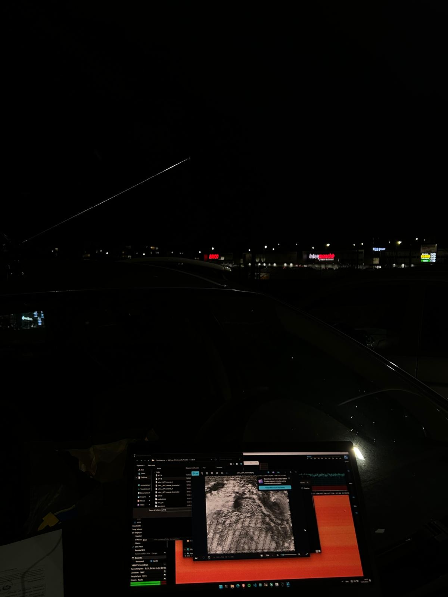

# NOAA 15 Weather Satellite Imagery Capture using RTL-SDR

## Overview
This project demonstrates how to capture live weather satellite imagery from NOAA 15 using an RTL-SDR v4. The process involves tracking the satellite, recording signals, decoding the data, and generating images.



## Tools & Resources Used
- **RTL-SDR v4** ([Quickstart Guide](https://www.rtl-sdr.com/qsg))
- **n2yo.com** – Satellite tracking
- **SDR++** – Software-defined radio application for recording signals
- **SatDump** – Decoding and processing satellite signals into images

## Steps to Replicate
### 1. Set Up RTL-SDR
Follow the [Quickstart Guide](https://www.rtl-sdr.com/qsg) to install the necessary drivers and software.

### 2. Track the Satellite
Use [n2yo.com](https://www.n2yo.com) to find the next overhead pass of NOAA 15 with a good elevation angle.

### 3. Record the Signal
- Open SDR++
- Tune to the **137.620 MHz** frequency
- Set the appropriate bandwidth and gain
- Record the audio signal as a WAV file

### 4. Decode & Convert to Imagery
- Load the recorded WAV file into **SatDump**
- Decode the APT signal to extract the image
- Enhance or process the image if needed


## Results
Here are some sample images captured and processed from NOAA 15.


## Challenges Faced
- Tuning the SDR settings for optimal reception
- Dealing with atmospheric interference
- Adjusting antenna position for best signal strength

## Future Improvements
- Automating the tracking and decoding process
- Experimenting with different antennas for better reception
- Expanding to other NOAA satellites like NOAA 18 and NOAA 19

## Repository Structure
```
📂 NOAA15-RTLSDR
│── README.md  # Project overview and setup guide
│── data/      # Sample images and recordings
```

## Contributions
Feel free to fork this project, submit issues, or contribute improvements!

## License
This project is licensed under the MIT License.

